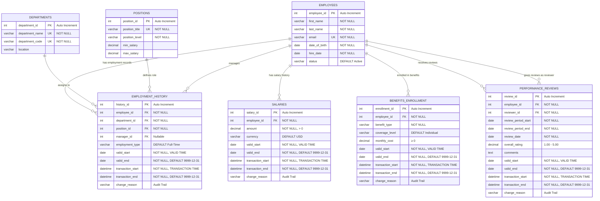

```mermaid
erDiagram
    %% ========================================================================
    %% CORE ENTITIES (Non-temporal)
    %% ========================================================================
    
    DEPARTMENTS {
        int department_id PK "Auto Increment"
        varchar department_name UK "NOT NULL"
        varchar department_code UK "NOT NULL"
        varchar location
    }
    
    POSITIONS {
        int position_id PK "Auto Increment"
        varchar position_title UK "NOT NULL"
        varchar position_level "NOT NULL"
        decimal min_salary
        decimal max_salary
    }
    
    EMPLOYEES {
        int employee_id PK "Auto Increment"
        varchar first_name "NOT NULL"
        varchar last_name "NOT NULL"
        varchar email UK "NOT NULL"
        date date_of_birth "NOT NULL"
        date hire_date "NOT NULL"
        varchar status "DEFAULT Active"
    }
    
    %% ========================================================================
    %% BITEMPORAL ENTITIES
    %% ========================================================================
    
    SALARIES {
        int salary_id PK "Auto Increment"
        int employee_id FK "NOT NULL"
        decimal amount "NOT NULL, > 0"
        varchar currency "DEFAULT USD"
        date valid_start "NOT NULL, VALID TIME"
        date valid_end "NOT NULL, DEFAULT 9999-12-31"
        datetime transaction_start "NOT NULL, TRANSACTION TIME"
        datetime transaction_end "NOT NULL, DEFAULT 9999-12-31"
        varchar change_reason "Audit Trail"
    }
    
    EMPLOYMENT_HISTORY {
        int history_id PK "Auto Increment"
        int employee_id FK "NOT NULL"
        int department_id FK "NOT NULL"
        int position_id FK "NOT NULL"
        int manager_id FK "Nullable"
        varchar employment_type "DEFAULT Full-Time"
        date valid_start "NOT NULL, VALID TIME"
        date valid_end "NOT NULL, DEFAULT 9999-12-31"
        datetime transaction_start "NOT NULL, TRANSACTION TIME"
        datetime transaction_end "NOT NULL, DEFAULT 9999-12-31"
        varchar change_reason "Audit Trail"
    }
    
    BENEFITS_ENROLLMENT {
        int enrollment_id PK "Auto Increment"
        int employee_id FK "NOT NULL"
        varchar benefit_type "NOT NULL"
        varchar coverage_level "DEFAULT Individual"
        decimal monthly_cost "≥ 0"
        date valid_start "NOT NULL, VALID TIME"
        date valid_end "NOT NULL, DEFAULT 9999-12-31"
        datetime transaction_start "NOT NULL, TRANSACTION TIME"
        datetime transaction_end "NOT NULL, DEFAULT 9999-12-31"
        varchar change_reason "Audit Trail"
    }
    
    PERFORMANCE_REVIEWS {
        int review_id PK "Auto Increment"
        int employee_id FK "NOT NULL"
        int reviewer_id FK "NOT NULL"
        date review_period_start "NOT NULL"
        date review_period_end "NOT NULL"
        date review_date "NOT NULL"
        decimal overall_rating "1.00 - 5.00"
        text comments
        date valid_start "NOT NULL, VALID TIME"
        date valid_end "NOT NULL, DEFAULT 9999-12-31"
        datetime transaction_start "NOT NULL, TRANSACTION TIME"
        datetime transaction_end "NOT NULL, DEFAULT 9999-12-31"
        varchar change_reason "Audit Trail"
    }
    
    %% ========================================================================
    %% RELATIONSHIPS
    %% ========================================================================
    
    %% Employee relationships
    EMPLOYEES ||--o{ SALARIES : "has salary history"
    EMPLOYEES ||--o{ EMPLOYMENT_HISTORY : "has employment records"
    EMPLOYEES ||--o{ BENEFITS_ENROLLMENT : "enrolled in benefits"
    EMPLOYEES ||--o{ PERFORMANCE_REVIEWS : "receives reviews"
    EMPLOYEES ||--o{ PERFORMANCE_REVIEWS : "gives reviews as reviewer"
    
    %% Department and Position relationships
    DEPARTMENTS ||--o{ EMPLOYMENT_HISTORY : "assigns to"
    POSITIONS ||--o{ EMPLOYMENT_HISTORY : "defines role"
    
    %% Manager relationship (self-referencing)
    EMPLOYEES ||--o{ EMPLOYMENT_HISTORY : "manages"
```